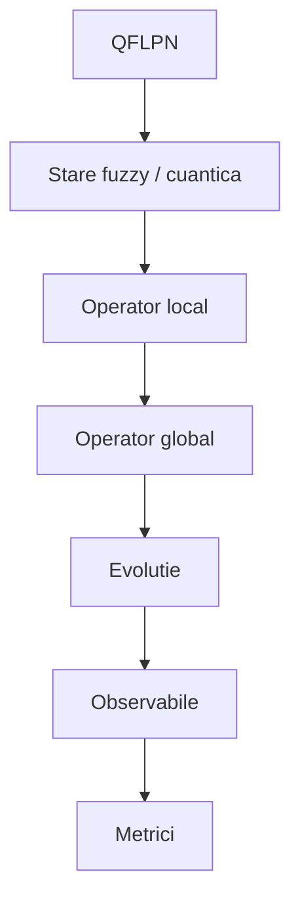

# 05. Algoritmi și software

## 1. Rolul capitolului

Capitolul transpune formalismul QFLPN într-o arhitectură algoritmică și software reproductibilă. Fiecare metodă prezentată trebuie să poată fi urmărită de la ecuația matematică la implementare și apoi la rezultatul experimental.

## 2. Principiul de trasabilitate

Fluxul este:

$$
\text{model QFLPN}
\rightarrow
\text{stare}
\rightarrow
\text{operator}
\rightarrow
\text{evoluție}
\rightarrow
\text{observabile}
\rightarrow
\text{metrici}.
$$

Pentru problema numerică principală:

$$
(A,v,t)\rightarrow y=e^{tA}v.
$$

## 3. Reprezentarea stării

Pentru `q` qubiți:

$$
|\psi\rangle=\sum_{j=0}^{N-1}\alpha_j|j\rangle,
\qquad N=2^q,
$$

cu

$$
\sum_{j=0}^{N-1}|\alpha_j|^2=1.
$$

Vectorul de stare are `N` componente complexe.

## 4. Convenția tensorială și indexarea

Se utilizează

$$
|q_0q_1\ldots q_{q-1}\rangle
=
|q_0\rangle\otimes\cdots\otimes|q_{q-1}\rangle.
$$

Pentru patru qubiți:

$$
|q_0q_1q_2q_3\rangle.
$$

Dacă implementarea folosește o convenție de memorie diferită, transformarea este o permutare explicită a indicilor. Nu se schimbă ecuațiile teoretice printr-o schimbare implicită de endianitate.

## 5. Operator local și global

Pentru qubitul `i`:

$$
\widetilde U_i=I_2^{\otimes i}\otimes U_i\otimes I_2^{\otimes(q-i-1)}.
$$

Pentru operații locale independente:

$$
U=U_0\otimes U_1\otimes\cdots\otimes U_{q-1}.
$$

Un exemplu de rotație este

$$
R_y(\theta)=
\begin{pmatrix}
\cos(\theta/2)&-\sin(\theta/2)\\
\sin(\theta/2)&\cos(\theta/2)
\end{pmatrix}.
$$

## 6. Maparea fuzzy–cuantică

Pentru `μ∈[0,1]` se utilizează, ca alegere de model,

$$
\theta=\pi\mu.
$$

Rezultă

$$
R_y(\pi\mu).
$$

Această mapare este o convenție a modelului QFLPN și nu trebuie formulată ca o echivalență universală între logica fuzzy și starea cuantică.

## 7. Regula de activare

În arhitectura QFLPN se separă:

$$
\text{activare tranziție}
\neq
\text{transformare cuantică}.
$$

Activarea este decisă de regulile Petri/fuzzy; după activare se aplică transformarea operatorială asociată.

## 8. Poarta controlată C³X

Pentru patru qubiți, o reprezentare conceptuală este

$$
C^3X=
(I-|111\rangle\langle111|)\otimes I
+
|111\rangle\langle111|\otimes X.
$$

Ordinea controalelor și a țintei trebuie să fie identică în figură, ecuație și cod.

## 9. Densitate și canal cuantic

Pentru o stare pură:

$$
\rho=|\psi\rangle\langle\psi|.
$$

Pentru o stare mixtă:

$$
\rho\succeq0,
\qquad \operatorname{Tr}(\rho)=1.
$$

Un canal CPTP are forma

$$
\mathcal E(\rho)=\sum_kK_k\rho K_k^\dagger,
$$

cu

$$
\sum_kK_k^\dagger K_k=I.
$$

## 10. Evoluție ideală și zgomotoasă

Regimul ideal utilizează operatori unitari sau evoluția declarată de model. Regimul zgomotos poate utiliza o mapare CPTP și, dacă este implementat, ecuația Lindblad:

$$
\frac{d\rho}{dt}
=-i[H,\rho]
+\sum_k\left(
L_k\rho L_k^\dagger
-\frac12\{L_k^\dagger L_k,\rho\}
\right).
$$

Modelul zgomotos trebuie declarat experimental numai dacă este efectiv implementat și măsurat.

## 11. Problema `e^{tA}v`

Obiectivul numeric este

$$
 y=e^{tA}v.
$$

Nu este necesară construirea matricei dense `e^{tA}` atunci când se urmărește numai acțiunea asupra lui `v`.

## 12. Taylor

Se utilizează recurența

$$
 w_0=v,
\qquad
w_{k+1}=Aw_k,
$$

și suma

$$
 y_m=\sum_{k=0}^{m}\frac{t^k}{k!}w_k.
$$

Pseudocod conceptual:

```text
w <- v
term <- v
y <- v
for k = 1,...,m:
    w <- A*w
    term <- (t/k)*w
    y <- y + term
return y
```

Formula de recurență trebuie adaptată exact implementării pentru evitarea recalculării factorialelor.

## 13. Taylor scalat

Se definește

$$
\tau=t/s,
$$

se aproximează `e^{τA}` și se aplică succesiv de `s` ori.

Parametrii `m` și `s` trebuie salvați în rezultatele experimentale.

## 14. Krylov/Arnoldi

Se construiește

$$
\mathcal K_m(A,v)=
\operatorname{span}\{v,Av,\ldots,A^{m-1}v\}.
$$

Relația Arnoldi:

$$
AV_m=V_mH_m+h_{m+1,m}v_{m+1}e_m^T.
$$

Aproximarea:

$$
 y_m=\|v\|_2V_me^{tH_m}e_1.
$$

## 15. Modified Gram-Schmidt

Pentru fiecare vector nou `w`:

$$
 h_{ij}=v_i^*w,
\qquad
w\leftarrow w-h_{ij}v_i.
$$

După normalizare:

$$
 h_{j+1,j}=\|w\|_2,
\qquad
v_{j+1}=w/h_{j+1,j}.
$$

Reortogonalizarea este permisă atunci când pierderea de ortogonalitate o justifică.

## 16. Parametri de referință pentru Arnoldi

| Parametru | Valoare |
|---|---:|
| q | 4,...,17 |
| N | 2^q |
| m maxim | 20 |
| aritmetică | float64/double |
| ortogonalizare | MGS + reortogonalizare |
| timp țintă de proiect | 15 ms |

Valoarea de 15 ms este un **obiectiv/reper experimental al proiectului**, nu o limită universală a metodei.

## 17. CSR

Matricea rară este reprezentată prin trei structuri:

- `data` — valorile nenule;
- `indices` — indicii coloanelor;
- `indptr` — delimitarea fiecărui rând.

Numărul de elemente nenule este `NNZ`.

## 18. SpMV

Operația fundamentală este

$$
 y=Av.
$$

Pentru CSR, costul este aproximativ

$$
O(\operatorname{NNZ}(A)).
$$

În metodele Krylov, SpMV este repetat pentru construirea bazei.

## 19. GPU și paralelism

Accelerarea GPU este relevantă numai pentru experimente efectiv executate pe GPU. Raportarea trebuie să includă hardware, runtime, precizie, dimensiune, NNZ și protocolul de măsurare.

Speedup-ul este

$$
S=\frac{T_{seq}}{T_{par}}.
$$

Nu se compară timpi obținuți pe hardware diferit ca și cum ar demonstra superioritate algoritmică absolută.

## 20. Interfață software

Arhitectura recomandată este:

```text
model QFLPN
    ↓
state/operator builder
    ↓
representation layer
    ↓
exponential-action solver
    ↓
metrics
    ↓
CSV results
    ↓
figures
```

Această separare permite folosirea aceleiași definiții matematice în Python și MATLAB/Octave.

## 21. Multi-limbaj

| Limbaj | Rol |
|---|---|
| Python | algoritmi numerici, procesare rezultate, grafice |
| MATLAB/Octave | implementare numerică independentă și comparație |
| Java | componentă software complementară/engine, dacă este utilizată efectiv |

Diferențele de timp dintre limbaje sunt raportate ca rezultate de implementare și hardware/runtime, nu ca teoreme de complexitate.

## 22. Structura rezultatelor

Rezultatele trebuie salvate în formate tabelare cu cel puțin:

| Câmp | Semnificație |
|---|---|
| q | număr qubiți |
| N | dimensiune |
| method | metoda numerică |
| m/order | parametrul metodei |
| mean_ms | timp mediu |
| median_ms | mediană |
| min_ms | minim |
| max_ms | maxim |
| max_abs_error | eroare absolută maximă |
| norm_error | eroare de normă |
| status | statut numeric |

## 23. Figuri obligatorii

### Figura 5.1 — Fluxul algoritmic QFLPN



Mermaid este machetă editabilă; figura finală trebuie redesenată vectorial.

### Figura 5.2 — Taylor versus Krylov

Trebuie să prezinte două ramuri care primesc același `(A,v,t)` și produc `y`, cu diferența dintre polinomul Taylor și proiecția Krylov evidențiată.

### Figura 5.3 — Arnoldi

Trebuie afișate `V_m`, `H_m`, relația Arnoldi și dimensiunile `N×m`, `m×m`.

### Figura 5.4 — CSR–SpMV

Trebuie să includă explicit `data`, `indices`, `indptr`, vectorul de intrare și vectorul rezultat.

### Figura 5.5 — Pipeline multi-limbaj

Python ↔ MATLAB/Octave ↔ Java, cu aceeași specificație matematică și aceleași câmpuri de rezultate.

### Figura 5.6 — Pipeline GPU

Date → CSR → transfer → kernel SpMV → reducere/actualizare → metrici. Se include numai dacă pipeline-ul GPU este efectiv utilizat.

## 24. Tabele obligatorii

1. Parametri numerici.
2. Structuri de date.
3. Metode și ecuații.
4. Complexități.
5. Câmpuri CSV.
6. Matrice cod–ecuație–rezultat.

## 25. Matrice de trasabilitate

| Ecuație | Algoritm | Fișier/rol | Rezultat |
|---|---|---|---|
| `N=2^q` | scalare | benchmark | q/N |
| `R_y(πμ)` | mapare fuzzy | operator builder | stare |
| `e^{tA}v` | Taylor | solver | y |
| `e^{tA}v` | Arnoldi | solver | y_m |
| `Av` | SpMV | CSR backend | vector |
| `S=T_seq/T_par` | benchmark | protocol HPC | speedup |

## 26. Reproductibilitate software

Pentru fiecare rulare trebuie păstrate:

- versiunea codului;
- parametrii;
- precizia numerică;
- q și N;
- NNZ;
- hardware relevant;
- runtime/libraries relevante;
- fișierul CSV rezultat;
- scriptul de generare a figurii.

## 27. Criteriu de închidere

Capitolul este final când fiecare metodă declarată experimental are ecuație, algoritm, parametri, implementare identificabilă, format de rezultat și criteriu de validare. Metodele menționate numai ca referințe teoretice trebuie marcate explicit ca atare.
