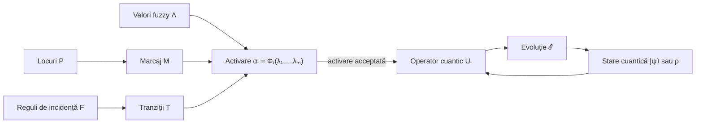
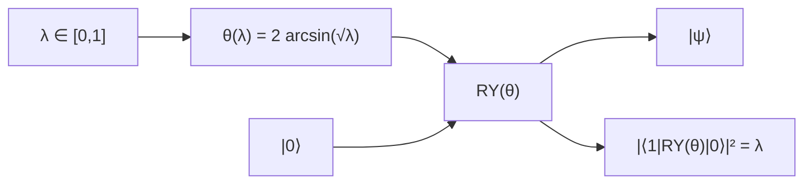
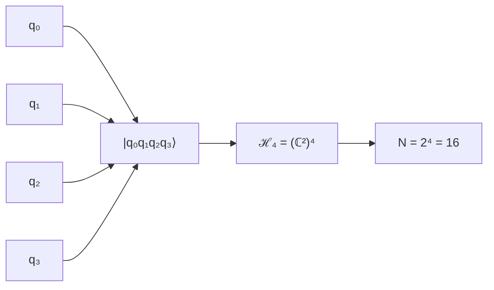
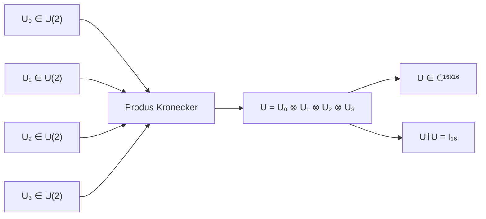
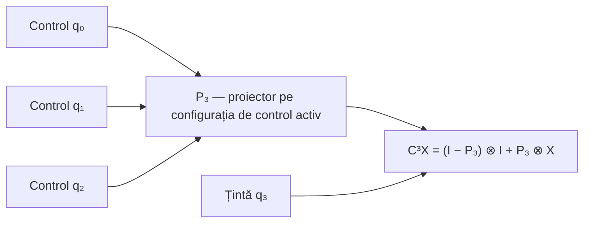
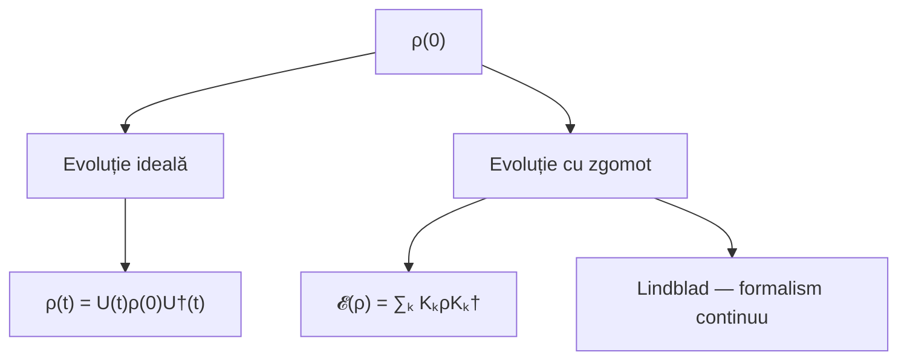
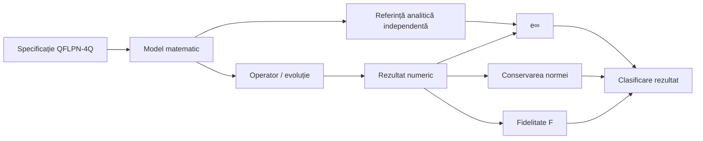
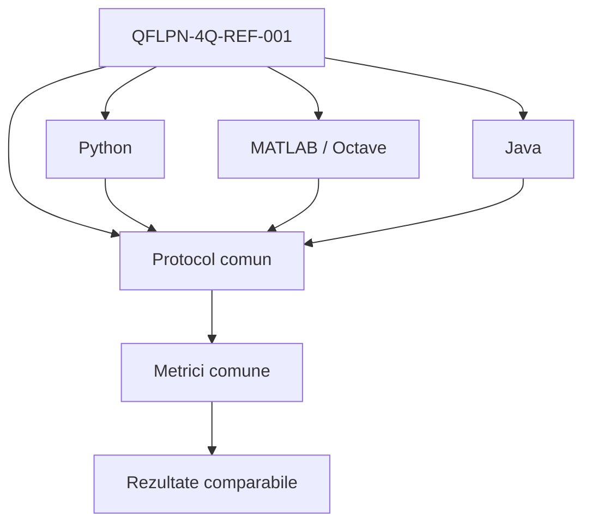
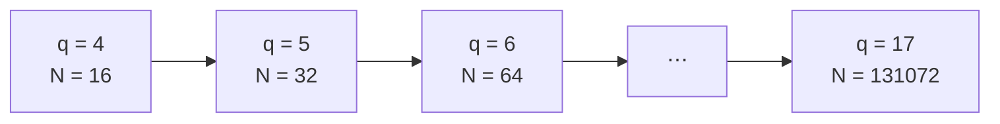

# Specificația de referință QFLPN-4Q

> **Identificator document:** QFLPN-4Q-REF-001
> **Revizia:** 1.0
> **Statut:** Specificație oficială de referință
> **Proiect:** Rețele Petri Logice Fuzzy-Cuantice (QFLPN)
> **Instanță de referință:** QFLPN-4Q
> **Dimensiunea spațiului Hilbert:** N = 2⁴ = 16

---

## 1. Scopul documentului

Prezenta specificație definește configurația matematică, convențiile de reprezentare, regulile de evoluție și criteriile de validare pentru instanța de referință **QFLPN-4Q**.

Documentul are rol de referință comună pentru:

- teza de doctorat;
- implementările software;
- experimentele numerice;
- figurile și tabelele asociate;
- articolele științifice derivate din proiect;
- verificarea trasabilității dintre modelul matematic și implementare.

Specificația nu înlocuiește formularea matematică detaliată din teză. Ea stabilește configurația de referință care trebuie respectată atunci când aceeași instanță QFLPN-4Q este implementată în mai multe limbaje sau utilizată în experimente comparative.

---

## 2. Definiția formală a instanței QFLPN-4Q

Instanța de referință este definită pe patru qubiți:

**q = 4**

Dimensiunea spațiului Hilbert asociat este:

**ℋ₄ = (ℂ²)⁴, dim(ℋ₄) = 2⁴ = 16**

Baza computațională este:

**ℬ₄ = {|0000⟩, |0001⟩, …, |1111⟩}**

Starea cuantică poate fi reprezentată prin:

**|ψ⟩ = ∑ₖ cₖ|k⟩**

cu condiția de normalizare:

**∑ₖ |cₖ|² = 1**

Pentru o stare pură, matricea de densitate este:

**ρ = |ψ⟩⟨ψ|**

iar, în cazul general:

**ρ ⪰ 0, Tr(ρ) = 1, ρ† = ρ**

---

## 3. Convenția de ordonare a qubiților

Pentru formularea matematică se adoptă convenția:

**|q₀q₁q₂q₃⟩ = |q₀⟩ ⊗ |q₁⟩ ⊗ |q₂⟩ ⊗ |q₃⟩**

Operatorii locali sunt ancorați explicit la pozițiile q₀, q₁, q₂ și q₃.

Pentru un operator local Uᵢ aplicat qubitului qᵢ, înglobarea în spațiul global este:

**Ũᵢ = I₂ⁱ ⊗ Uᵢ ⊗ I₂³⁻ⁱ**

Aceasta este **convenția matematică oficială** a documentului.

O implementare software poate utiliza o altă convenție internă de indexare, de exemplu little-endian. În acest caz, conversia dintre ordonarea matematică și ordonarea internă trebuie documentată explicit. Nu este permisă schimbarea implicită a ordinii qubiților între implementări.

---

## 4. Valorile fuzzy și interfața fuzzy–cuantică

Fiecărei condiții fuzzy relevante îi poate fi asociată o valoare:

**λ ∈ [0, 1]**

Pentru instanța QFLPN-4Q se utilizează următoarea convenție de codificare:

**θ(λ) = 2 arcsin(√λ)**

Rotația RY este:

**RY(θ) = [[cos(θ/2), −sin(θ/2)], [sin(θ/2), cos(θ/2)]]**

Pornind din |0⟩, probabilitatea de observare a stării |1⟩ este:

**|⟨1|RY(θ)|0⟩|² = sin²(θ/2) = λ**

Această relație definește **convenția de modelare utilizată în QFLPN-4Q**. Ea nu trebuie interpretată drept o identitate universală între logica fuzzy și probabilitatea cuantică.

Pentru λ = 0:

**θ = 0**

Pentru λ = 1:

**θ = π**

---

## 5. Operatorii locali și transformarea globală

Pentru fiecare qubit se poate defini un operator local:

**Uᵢ ∈ U(2)**

Operatorul global rezultat prin produs tensorial este:

**U = U₀ ⊗ U₁ ⊗ U₂ ⊗ U₃**

Dacă fiecare Uᵢ este unitar, atunci:

**U†U = I₁₆**

Dimensiunea operatorului global este:

**U ∈ ℂ¹⁶ˣ¹⁶**

În cazul unei evoluții unitare:

**|ψ′⟩ = U|ψ⟩**

Pentru matricea de densitate:

**ρ′ = UρU†**

---

## 6. Operatori controlați

Operatorii controlați trebuie definiți prin proiectori și operatori locali, pentru a evita ambiguitatea asupra convenției de control și țintă.

Pentru un control pe un qubit și un operator V pe țintă, în ordinea tensorială
(control, țintă), se definește:

**C(V) = |0⟩⟨0| ⊗ I + |1⟩⟨1| ⊗ V**

Pentru mai mulți qubiți de control, se utilizează proiectori asupra subspațiului
de control, iar pozițiile control/țintă trebuie specificate explicit.

Pentru instanța QFLPN-4Q, dacă q₀, q₁ și q₂ sunt controalele, iar q₃ este ținta,
se poate scrie:

**C³(V) = (I₈ − P₃) ⊗ I₂ + P₃ ⊗ V**

unde **P₃** este proiectorul de rang 1 asupra configurației de control active
**|111⟩⟨111|** în subspațiul celor trei controale.

Pentru V = X, operatorul corespunde unei porți **C³X**, cu convenția de control definită explicit de configurația de bază.

---

## 7. Modelul QFLPN

Modelul conceptual este reprezentat printr-un tuplu de forma:

**𝒬 = (P, T, F, M, Λ, ℋ, 𝒰, ℰ)**

unde:

- **P** este mulțimea locurilor;
- **T** este mulțimea tranzițiilor;
- **F** este relația de incidență;
- **M** este marcajul;
- **Λ** reprezintă valorile fuzzy;
- **ℋ** este spațiul Hilbert;
- **𝒰** este familia operatorilor de evoluție;
- **ℰ** reprezintă regulile de evoluție.

În QFLPN, partea logică/fuzzy determină condițiile de activare, iar partea cuantică determină transformarea stării.

Această separare este importantă:

**activare ≠ transformare cuantică**

O tranziție poate fi activată pe baza regulilor fuzzy fără ca aceasta să implice automat o transformare unitară specifică. Transformarea trebuie definită separat prin operatorul asociat tranziției.

---

## 8. Regula de activare

O tranziție t ∈ T poate fi activată dacă valoarea de activare satisface criteriul modelului.

Într-o formulare simplificată:

**αₜ = Φₜ(λ₁, λ₂, …, λₘ)**

unde:

**αₜ ∈ [0, 1]**

Funcția Φₜ trebuie precizată pentru fiecare experiment. Nu se presupune implicit o singură t-normă, t-conormă sau operator fuzzy universal pentru toate instanțele.

Când activarea este acceptată, tranziția aplică operatorul cuantic asociat:

**|ψ′⟩ = Uₜ|ψ⟩**

Pentru o stare mixtă:

**ρ′ = UₜρUₜ†**

---

## 9. Păstrarea proprietăților fizice

Dacă:

**ρ ⪰ 0, Tr(ρ) = 1**

și U este unitar, atunci:

**ρ′ = UρU†**

păstrează pozitivitatea și urma unitară.

În particular:

**Tr(ρ′) = Tr(UρU†) = Tr(ρU†U) = Tr(ρ) = 1**

Această proprietate constituie una dintre condițiile de validare numerică pentru evoluția ideală.

---

## 10. Modelul de decoerență și zgomot

Evoluția ideală și evoluția cu zgomot trebuie tratate distinct.

### 10.1 Evoluția ideală

**ρ(t) = U(t)ρ(0)U†(t)**

### 10.2 Canal cu operatori Kraus

O evoluție generală poate fi exprimată prin:

**𝓔(ρ) = ∑ₖ KₖρKₖ†**

cu condiția:

**∑ₖ Kₖ†Kₖ = I**

Aceasta asigură păstrarea urmei:

**Tr(𝓔(ρ)) = Tr(ρ)**

### 10.3 Ecuația Lindblad

Pentru o descriere continuă a dinamicii disipative:

**dρ/dt = −i[H,ρ] + ∑ₖ (LₖρLₖ† − ½{Lₖ†Lₖ,ρ})**

Modelul Lindblad este utilizat ca **formalism teoretic** atunci când nu există o implementare și o validare numerică explicită a canalelor de zgomot.

Prin urmare, o formulare teoretică nu trebuie prezentată ca rezultat experimental.

---

## 11. Criterii de validare pentru QFLPN-4Q

O implementare conformă trebuie să poată verifica cel puțin următoarele proprietăți.

### 11.1 Unitaritate

Pentru operatorul global:

**‖U†U − I‖**

trebuie să fie sub toleranța numerică stabilită de experiment.

### 11.2 Conservarea normei

Pentru:

**|ψ′⟩ = U|ψ⟩**

se verifică:

**|‖ψ′‖₂ − ‖ψ‖₂| ≤ ε**

### 11.3 Eroarea maximă față de referință

Pentru rezultatul numeric y și referința analitică y_ref:

**e∞ = maxᵢ |yᵢ − yᵢ,ref|**

### 11.4 Fidelitatea

Pentru două stări pure:

**F(ψ, φ) = |⟨ψ|φ⟩|²**

Pentru stări mixte se utilizează definiția fidelității compatibilă cu formalismul ales.

Fidelitatea este utilizată pentru validarea stării rezultate și nu trebuie confundată cu simpla comparație componentă-cu-componentă.

---

## 12. Referința analitică

Validarea QFLPN-4Q trebuie să utilizeze o referință independentă de implementarea numerică verificată.

În cazul în care operatorul global are structură tensorială:

**U = U₀ ⊗ U₁ ⊗ U₂ ⊗ U₃**

referința poate fi construită direct din operatorii locali și aplicată vectorului inițial.

Nu este suficient ca implementarea și referința să apeleze aceeași funcție numerică și să compare rezultatul cu propria ieșire.

Referința trebuie să fie derivată dintr-o formulare matematică independentă sau dintr-o construcție exactă echivalentă, documentată explicit.

---

## 13. Protocol numeric reproducibil

Pentru experimentele de referință se utilizează, unde este aplicabil:

| Parametru | Valoare de referință |
|---|---:|
| Număr de qubiți | q = 4 |
| Număr de stări | N = 2⁴ = 16 |
| Precizie | `float64` / `double` |
| Încălzire inițială | 20 execuții |
| Repetări măsurate | 1000 |
| Eroare numerică | față de referință independentă |
| Conservarea normei | verificată |
| Fidelitatea | raportată când este relevantă |
| Timp | medie, mediană, minim, maxim |
| Prag de performanță | 15 ms, ca obiectiv de proiect |

Pragul de **15 ms este un obiectiv de performanță și un reper experimental al proiectului**, nu o afirmație universală privind performanța tuturor implementărilor sau platformelor.

---

## 14. Extinderea la scalare

Pentru studiile de scalare, numărul de qubiți și dimensiunea spațiului Hilbert sunt legate prin:

**N = 2ᑫ**

Familia de referință pentru scalarea curentă este:

**q = 4, 5, …, 17**

adică:

**N = 16, 32, 64, …, 131072**

Această relație trebuie păstrată explicit în toate tabelele și figurile de scalare.

Nu se va utiliza termenul „număr de qubiți” pentru o dimensiune N care nu este de forma N = 2ᑫ.

Valorile de dimensiune utilizate în alte benchmark-uri HPC pot reprezenta volume de lucru sau numere de elemente și trebuie etichetate separat de dimensiunea Hilbert.

---

## 15. Reprezentarea sparse

Atunci când operatorul are structură rară, reprezentarea CSR poate fi utilizată pentru stocarea matricei:

**A ∈ ℂᴺˣᴺ**

Acțiunea operatorului asupra unui vector:

**y = Av**

este implementată prin SpMV.

Costul trebuie discutat în funcție de numărul de elemente nenule:

**NNZ(A)**

nu numai în funcție de N².

Pentru o matrice CSR, memoria este de ordinul:

**O(N + NNZ(A))**

iar costul unei operații SpMV este, în general:

**O(NNZ(A))**

---

## 16. Operatorul exponențial

Pentru dinamica:

**dψ/dt = Aψ**

soluția formală este:

**ψ(t) = eᵗᴬψ(0)**

În cazul în care se dorește numai acțiunea exponențialei asupra unui vector, obiectul numeric este:

**y = eᵗᴬv**

Această problemă este distinctă de calculul explicit al întregii matrice:

**eᵗᴬ**

Metodele Taylor, Krylov/Arnoldi, Lanczos, Chebyshev sau alte metode pot fi comparate numai dacă problema, operatorul, vectorul inițial, timpul, precizia și protocolul de măsurare sunt menținute comparabile.

---

## 17. Condiția pentru metoda Krylov

Subspațiul Krylov de ordin m este:

**𝒦ₘ(A,v) = span{v, Av, A²v, …, Aᵐ⁻¹v}**

În Arnoldi:

**AVₘ = Vₘ₊₁ H̄ₘ**

iar aproximarea acțiunii exponențialei are forma:

**eᵗᴬv ≈ Vₘeᵗᴴᵐ(βe₁)**

unde:

**β = ‖v‖₂**

Ortogonalizarea și reortogonalizarea trebuie documentate atunci când influențează stabilitatea numerică.

Un operator cu structură excesiv de uniformă poate avea un polinom minimal de grad mic, ceea ce poate conduce la un subspațiu Krylov efectiv de dimensiune redusă. O astfel de instanță nu este suficientă pentru a susține concluzii generale privind superioritatea metodei.

---

## 18. Compararea metodelor numerice

Comparațiile trebuie să fie controlate.

Pentru două metode M₁ și M₂, trebuie păstrate aceleași:

- operator A;
- vector inițial v;
- timp t;
- precizie numerică;
- criteriu de oprire;
- hardware;
- configurație software;
- protocol de măsurare.

Indicatorii pot include:

**T_mean, T_median, T_min, T_max**

precum și:

**e∞, e_norm, F**

Nu se va declara un „câștig universal” al unei metode numai pe baza unei singure instanțe structurale.

---

## 19. Reproductibilitate multi-limbaj

Implementările de referință pot exista în:

- MATLAB/Octave;
- Python;
- Java;
- alte medii documentate explicit.

Toate implementările trebuie să respecte aceeași specificație matematică.

Diferențele de:

- indexare;
- ordonare a bazei;
- convenție endian;
- tip numeric;
- bibliotecă liniară;
- reprezentare sparse;

trebuie documentate și nu trebuie confundate cu diferențe ale modelului QFLPN.

Rezultatele numerice trebuie comparate prin metrici comune.

---

## 20. Regula de modificare și control al versiunilor

Orice modificare care schimbă:

- ordonarea qubiților;
- definiția mapării fuzzy;
- operatorul local;
- operatorul global;
- starea inițială;
- regula de activare;
- parametrizarea experimentului;
- criteriul de validare;

constituie o modificare a specificației și trebuie înregistrată printr-o nouă revizie.

Modificările pur documentare, de formatare sau de clarificare editorială pot fi înregistrate separat, fără schimbarea identificatorului matematic al instanței.

---

## 21. Trasabilitate între specificație, teză și software

Instanța QFLPN-4Q trebuie să fie identificabilă în:

1. formularea matematică din teză;
2. figurile circuitului;
3. figurile distribuției de probabilitate;
4. codul sursă;
5. rezultatele numerice;
6. tabelele de validare;
7. articolele științifice care utilizează instanța.

În toate aceste materiale trebuie păstrată aceeași definiție pentru:

**q = 4, N = 16**

precum și aceeași convenție de ordonare a bazei.

---

## 22. Convenția pentru figurile QFLPN-4Q

În această revizie, figurile sunt introduse mai întâi ca **machete Mermaid editabile**. Blocurile Mermaid reprezintă sursa diagramelor; la randarea în GitHub, acestea sunt afișate ca diagrame, nu ca text de cod. Ele nu sunt considerate încă figuri finale pentru teză sau publicații. Fiecare diagramă trebuie verificată matematic și structural înainte de transformarea ei într-o figură vectorială definitivă.

### 22.1 Machetă — arhitectura generală QFLPN

**Verificare conceptuală:** diagrama păstrează separarea obligatorie `activare ≠ transformare cuantică`: regula fuzzy decide activarea, iar operatorul asociat tranziției realizează transformarea stării.

### 22.2 Machetă — interfața fuzzy–cuantică

**Verificare matematică:** pentru `λ ∈ [0,1]`, rezultă `θ ∈ [0,π]`, iar relația indicată reproduce exact `sin²(θ/2) = λ`. Diagrama prezintă explicit această mapare ca **alegere de modelare**, nu ca identitate universală.

### 22.3 Machetă — ordonarea celor patru qubiți

**Verificare structurală:** ordinea afișată este `q₀, q₁, q₂, q₃`, iar dimensiunea rezultată este `16`. Orice convenție software diferită trebuie tratată printr-o conversie explicită.

### 22.4 Machetă — transformarea locală în operator global

**Verificare matematică:** dacă fiecare `Uᵢ` este unitar, produsul Kronecker este unitar. Dimensiunea este `2⁴ × 2⁴ = 16 × 16`.

### 22.5 Machetă — operator controlat C³X

**Verificare structurală:** diagrama identifică separat cei trei qubiți de control și qubitul țintă. Formula trebuie interpretată pe descompunerea control/țintă corespunzătoare; ordinea tensorială exactă trebuie păstrată conform convenției din secțiunea 3.

### 22.6 Machetă — evoluție ideală și evoluție cu zgomot

**Verificare conceptuală:** evoluția ideală nu este amestecată cu modelul de zgomot. Kraus și Lindblad sunt prezentate ca ramuri distincte; Lindblad rămâne formalism teoretic dacă nu există implementare și validare numerică explicită.

### 22.7 Machetă — fluxul de validare

**Verificare metodologică:** referința analitică este separată de implementarea numerică. Indicatorii `e∞`, norma și fidelitatea sunt tratate ca metrici distincte.

### 22.8 Machetă — reproducibilitate multi-limbaj

**Verificare înainte de figura finală:** aceeași definiție matematică, aceeași ordine a bazei, aceeași precizie și același protocol trebuie păstrate între implementări.

### 22.9 Machetă — scalarea QFLPN

**Verificare matematică:** fiecare treaptă respectă `N = 2ᑫ`. Diagrama nu asociază dimensiuni arbitrare `N` cu un număr de qubiți.

### 22.10 Regula de aprobare a machetelor

Machetele Mermaid din această secțiune au statut de **diagramă de lucru**. Înainte de conversia în figuri finale se verifică:

1. consistența cu definițiile matematice;
2. ordinea qubiților și a bazei;
3. dimensiunile operatorilor;
4. sensul săgeților și direcția evoluției;
5. separarea dintre activare, transformare și zgomot;
6. corespondența dintre formule și etichetele grafice;
7. trasabilitatea către cod și rezultate;
8. lizibilitatea la dimensiunea finală din teză.

Figura finală se produce numai după închiderea acestei verificări.

### 22.11 Cerința existentă pentru figurile finale

Figura circuitului trebuie să indice explicit:

- cei patru qubiți;
- ordinea q₀, q₁, q₂, q₃;
- operațiile locale;
- operațiile controlate;
- direcția temporală a evoluției.

Figura distribuției de probabilitate trebuie să utilizeze aceeași ordine a stărilor ca reprezentarea matematică.

Dacă ordinea este:

**|0000⟩, |0001⟩, …, |1111⟩**

aceasta trebuie menținută în toate reprezentările grafice sau trebuie prezentată explicit o permutare.

---

## 23. Criterii de conformitate

O implementare este considerată conformă cu QFLPN-4Q dacă:

- utilizează q = 4;
- operează în ℋ₄ de dimensiune 16;
- respectă convenția de bază documentată;
- utilizează maparea fuzzy–rotație definită în această specificație atunci când maparea respectivă este folosită;
- păstrează consistența dintre operatorii locali și operatorul global;
- verifică proprietățile numerice relevante;
- raportează protocolul experimental;
- permite trasabilitatea parametrilor;
- nu prezintă rezultate teoretice drept rezultate experimentale.

---

## 24. Statutul rezultatelor

Rezultatele asociate QFLPN-4Q trebuie clasificate explicit ca:

- **rezultat analitic** – derivat matematic;
- **rezultat numeric** – obținut prin calcul;
- **rezultat experimental** – obținut prin execuții măsurate;
- **referință structurală** – utilizată pentru verificarea unei proprietăți;
- **obiectiv de proiect** – țintă de performanță, fără a implica automat atingerea ei.

Această separare este obligatorie pentru interpretarea corectă a concluziilor.

---

## 25. Declarație oficială de referință

Instanța QFLPN-4Q definită prin prezenta specificație constituie configurația matematică și software de referință pentru dezvoltarea și validarea proiectului QFLPN.

Formula centrală de identificare este:

**q = 4, N = 2⁴ = 16, ℋ₄ = (ℂ²)⁴**

cu ordonarea matematică:

**|q₀q₁q₂q₃⟩ = |q₀⟩ ⊗ |q₁⟩ ⊗ |q₂⟩ ⊗ |q₃⟩**

și cu operatorul global, pentru operații locale simultane:

**U = U₀ ⊗ U₁ ⊗ U₂ ⊗ U₃**

Pentru maparea fuzzy–cuantică de referință:

**θ(λ) = 2 arcsin(√λ)**

Aceste convenții reprezintă nucleul de referință al instanței QFLPN-4Q și trebuie menținute identic în documentația, implementările și experimentele care declară conformitatea cu această specificație.

---

## 26. Istoricul reviziilor

| Revizie | Data | Modificare |
|---|---|---|
| 1.0 | 2026 | Stabilirea specificației oficiale QFLPN-4Q |

---

## 27. Notă finală

Prezenta specificație este concepută ca document tehnic de referință. Ea poate fi extinsă prin revizii succesive, însă orice modificare a convențiilor matematice fundamentale trebuie înregistrată explicit.

În special, nu se modifică implicit:

**q = 4, N = 16, θ(λ) = 2 arcsin(√λ)**

sau ordonarea:

**|q₀q₁q₂q₃⟩**

Orice variantă care utilizează alte convenții trebuie identificată ca o configurație distinctă sau ca o nouă revizie a specificației.

---

## 28. Declarație de integritate și reproductibilitate

Prezenta specificație stabilește un set unic de convenții pentru instanța QFLPN-4Q. Orice implementare care declară conformitatea cu documentul trebuie să utilizeze aceleași definiții matematice sau să documenteze explicit orice abatere.

Reproductibilitatea presupune că, pentru aceiași:

- parametri matematici;
- stare inițială;
- operatori;
- convenție de ordonare;
- precizie numerică;
- condiții de execuție;
- protocol de măsurare;

rezultatele obținute independent trebuie să fie comparabile în limitele erorii numerice și ale diferențelor documentate dintre platforme.

Pentru identificarea unei configurații reproductibile se recomandă păstrarea următoarelor informații:

| Element | Cerință |
|---|---|
| Identificator specificație | QFLPN-4Q-REF-001 |
| Revizie | indicată explicit |
| q | 4 pentru instanța de referință |
| N | 16 pentru instanța de referință |
| Ordonare bază | q₀, q₁, q₂, q₃ |
| Mapare fuzzy | θ(λ) = 2 arcsin(√λ), când este utilizată |
| Tip numeric | `float64` / `double` |
| Operator | definit explicit |
| Stare inițială | definită explicit |
| Mediu software | versiune și biblioteci documentate |
| Hardware | documentat pentru rezultate de performanță |
| Protocol | parametri și criterii raportate |

O diferență de implementare nu trebuie considerată eroare a modelului înainte de a fi verificată prin raportare la această specificație.

Prin această secțiune, QFLPN-4Q este definit nu numai ca o instanță matematică de referință, ci și ca o **configurație reproductibilă și trasabilă** pentru dezvoltarea software, validarea numerică și documentarea științifică.

---
